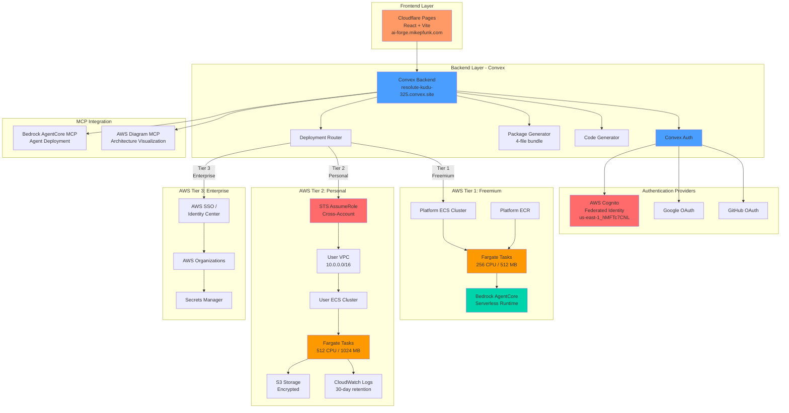

# Agent Builder Application - Generated Architecture Diagram

**Generated**: 2025-10-19T21:50:26.050Z
**Resources**: 20

## System Architecture

## Architecture Overview

### Frontend
- **Platform**: Cloudflare Pages
- **Framework**: React + Vite + TypeScript
- **Production URL**: https://ai-forge.mikepfunk.com
- **Deployment URL**: https://633051e6.agent-builder-application.pages.dev

### Backend
- **Platform**: Convex (Serverless)
- **URL**: https://resolute-kudu-325.convex.site
- **Features**:
  - Real-time data synchronization
  - Serverless functions
  - Built-in authentication
  - Code generation pipeline
  - Deployment routing

### Authentication
1. **GitHub OAuth** - GitHub authentication
2. **Google OAuth** - Google authentication
3. **AWS Cognito** - Federated identity with STS AssumeRole
   - User Pool: us-east-1_hMFTc7CNL
   - Client ID: fk09hmkpbk7sral3cj9ofh5vc

### Deployment Tiers

#### Tier 1: Freemium (Platform Fargate)
- **Target**: Free tier users
- **Limit**: 10 tests/month
- **Infrastructure**:
  - Platform-managed ECS cluster
  - Fargate tasks (256 CPU, 512 MB memory)
  - Shared ECR repository
  - AWS Bedrock AgentCore runtime

#### Tier 2: Personal (User AWS Account)
- **Target**: Personal tier users
- **Features**:
  - Cross-account deployment via STS AssumeRole
  - User-owned VPC (10.0.0.0/16)
  - User ECS cluster
  - Fargate tasks (512 CPU, 1024 MB memory)
  - CloudWatch Logs (30-day retention)
  - S3 storage (encrypted)

#### Tier 3: Enterprise (SSO)
- **Target**: Enterprise customers
- **Features**:
  - AWS SSO / Identity Center integration
  - AWS Organizations management
  - Secrets Manager for sensitive data
  - Enhanced security and compliance

### MCP Integration
- **AWS Diagram MCP**: Architecture visualization tool
- **Bedrock AgentCore MCP**: Agent deployment and testing

## Resource List

1. **cloudflare-pages**: Agent Builder Frontend
2. **convex-backend**: Convex Backend
3. **auth-provider**: GitHub OAuth
4. **auth-provider**: Google OAuth
5. **cognito-user-pool**: AWS Cognito Auth (us-east-1_hMFTc7CNL)
6. **ecs-cluster**: Platform ECS Cluster
7. **ecs-fargate**: Agent Runtime (Tier 1)
8. **ecr**: Platform ECR Repository
9. **bedrock-agentcore**: AWS Bedrock AgentCore
10. **iam-role**: Cross-Account Role
11. **vpc**: User VPC (Tier 2)
12. **ecs-cluster**: User ECS Cluster
13. **ecs-fargate**: Agent Runtime (Tier 2)
14. **cloudwatch-logs**: Agent Logs
15. **s3**: Deployment Artifacts
16. **sso**: AWS SSO
17. **organizations**: AWS Organizations
18. **secrets-manager**: Enterprise Secrets
19. **mcp-server**: AWS Diagram MCP
20. **mcp-server**: Bedrock AgentCore MCP

## Key Features

### 4-File Deployment Bundle
Every agent deployment generates:
1. **agent.py** - Agent code with @agent decorator
2. **mcp.json** - MCP server configuration
3. **Dockerfile** - Container configuration
4. **cloudformation.yaml** - AWS infrastructure template

### Security
- ✅ Proper access control using Convex user document IDs
- ✅ STS temporary credentials for cross-account deployment
- ✅ External ID validation for AssumeRole
- ✅ Encrypted S3 storage
- ✅ Secrets Manager for sensitive data

### Agent Capabilities
- Preprocessing and postprocessing hooks
- MCP tool integration
- Meta-tooling for dynamic tool creation
- Memory and interleaved reasoning
- AWS Bedrock AgentCore runtime

---

**Note**: This diagram was generated using a simplified Mermaid generator.
For deployment-specific diagrams, use the built-in `awsDiagramGenerator` module.
