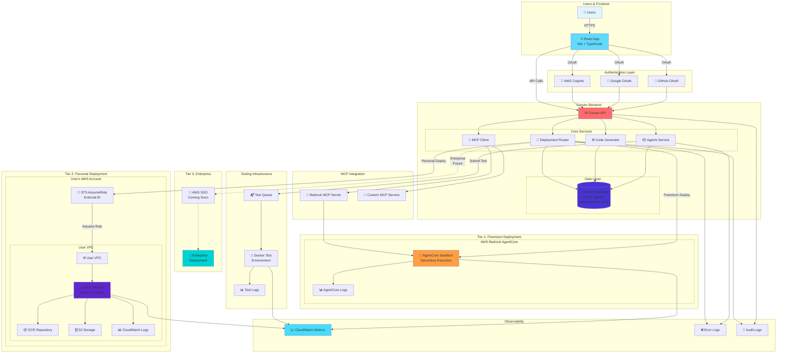

# Agent Builder Application - Architecture Diagram

## 3-Tier Deployment Architecture

## Architecture Overview

### Frontend Layer
- **React + Vite**: Modern, fast frontend built with TypeScript
- **Authentication**: Multi-provider OAuth (GitHub, Google, AWS Cognito)
- **UI Components**: Agent builder, tester, deployment panel, MCP management

### Backend Layer (Convex)
- **Convex API**: Serverless backend with real-time subscriptions
- **Core Services**:
  - **Agents Service**: CRUD operations for AI agents
  - **Code Generator**: Generates Python agent code with decorators
  - **Deployment Router**: Routes deployments based on user tier
  - **MCP Client**: Integrates with Model Context Protocol servers
- **Database**: Convex database storing users, agents, deployments, tests

### Deployment Tiers

#### Tier 1: Freemium (AgentCore)
- **Target**: Free tier users
- **Infrastructure**: AWS Bedrock AgentCore sandboxes
- **Limits**: 10 tests/month
- **Benefits**: Zero AWS setup, instant deployment
- **Use Case**: Testing and prototyping

#### Tier 2: Personal (User's AWS)
- **Target**: Personal tier users
- **Infrastructure**: User's AWS account via cross-account role
- **Access**: STS AssumeRole with External ID
- **Deployment**: ECS Fargate containers
- **Benefits**: Full control, no usage limits, own AWS resources
- **Use Case**: Production deployments

#### Tier 3: Enterprise (Coming Soon)
- **Target**: Enterprise customers
- **Infrastructure**: Enterprise AWS account
- **Access**: AWS SSO integration
- **Benefits**: Centralized management, compliance, cost allocation
- **Use Case**: Large-scale enterprise deployments

### MCP Integration
- **Bedrock MCP Server**: Integrates with AWS Bedrock AgentCore
- **Custom MCP Servers**: User-configured MCP servers for tools
- **Agent-to-Agent**: Agents can be exposed as MCP tools

### Testing Infrastructure
- **Test Queue**: SQS-based queue for test execution
- **Docker Environment**: Isolated container testing
- **AgentCore Testing**: Serverless test execution
- **Fargate Testing**: Production-like testing in ECS

### Observability
- **CloudWatch Metrics**: Performance and health monitoring
- **Error Logs**: Centralized error tracking
- **Audit Logs**: Security and compliance tracking
- **Health Checks**: Automated deployment health monitoring

## Data Flow

### Agent Creation Flow
1. User creates agent in React UI
2. Frontend calls Convex API
3. Code Generator creates Python agent code
4. Agent stored in Convex database

### Deployment Flow (Tier 1)
1. User clicks "Deploy" for freemium agent
2. Deployment Router checks tier and usage limits
3. Routes to AgentCore deployment
4. MCP Client creates AgentCore sandbox
5. Sandbox ID stored in deployments table
6. Health monitoring begins

### Deployment Flow (Tier 2)
1. User clicks "Deploy" for personal tier agent
2. Deployment Router checks AWS account connection
3. STS AssumeRole with External ID
4. Build Docker image and push to user's ECR
5. Create ECS task definition
6. Run Fargate task in user's VPC
7. Task ARN stored in deployments table
8. CloudWatch logs streaming

### Testing Flow
1. User submits test query
2. Test execution record created
3. Test added to queue
4. Queue processor picks up test
5. Docker container built with agent code
6. Test executed in isolated environment
7. Logs collected and streamed
8. Results stored in database

## Security Features

- **OAuth Authentication**: Multi-provider with custom profile handlers
- **Cross-Account Access**: Secure STS AssumeRole with External ID
- **Secrets Management**: AWS Secrets Manager integration
- **Network Isolation**: VPC-based deployments for Tier 2/3
- **Audit Logging**: Comprehensive audit trail
- **Error Tracking**: Centralized error logging with severity levels

## Key Technologies

- **Frontend**: React, TypeScript, Vite, Tailwind CSS
- **Backend**: Convex (serverless)
- **Authentication**: Convex Auth, OAuth 2.0
- **AWS Services**: Bedrock, ECS Fargate, ECR, S3, CloudWatch, STS, IAM
- **Containerization**: Docker
- **MCP**: Model Context Protocol for tool integration
- **Monitoring**: CloudWatch, custom error/audit logging
