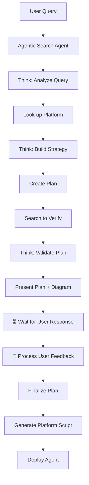

# Agentic Search System Implementation Plan

## 🎯 Vision
Create a sophisticated agentic search system that uses AI agents to perform intelligent, multi-step searches for building agents on different platforms (AWS, Google Cloud, etc.).

##  Architecture Overview



##  Detailed Implementation Plan

### Phase 1: Core Agentic Search System
- [ ] **Query Analysis Agent** - Analyze user query and determine intent
- [ ] **Platform Detection Agent** - Identify target platform (AWS, GCP, Azure, etc.)
- [ ] **Architecture Research Agent** - Research platform-specific architecture patterns
- [ ] **Plan Generation Agent** - Create detailed implementation plan
- [ ] **Verification Agent** - Cross-validate plan against multiple sources
- [ ] **Script Generator Agent** - Generate platform-specific deployment scripts

### Phase 2: Platform-Specific Integrations
- [ ] **AWS Bedrock Agent Builder** - Specialized for AWS Bedrock agents
- [ ] **Google Cloud Vertex AI Agent** - Specialized for Google Cloud agents
- [ ] **Azure OpenAI Agent** - Specialized for Azure OpenAI agents
- [ ] **Generic Platform Agent** - For other platforms and custom implementations

### Phase 3: Advanced Features
- [ ] **Multi-Platform Comparison** - Compare implementations across platforms
- [ ] **Cost Optimization Analysis** - Optimize for cost across platforms
- [ ] **Performance Benchmarking** - Compare performance characteristics
- [ ] **Security Compliance** - Ensure compliance across different platforms

##  Agentic Search Workflow

### Step 1: Query Analysis
```
User: "Build me a customer support chatbot for AWS"

Agent thinks: "This is a request to build a chatbot. Target platform: AWS.
Need to understand: use case, requirements, technical constraints, budget, timeline"
```

### Step 2: Platform Research
```
Agent thinks: "Researching AWS Bedrock for chatbot development.
Key considerations: Lambda integration, API Gateway, DynamoDB, security, costs"
```

### Step 3: Plan Creation
```
Agent thinks: "Creating comprehensive plan:
1. AWS Bedrock agent setup
2. Lambda function for processing
3. API Gateway for endpoints
4. DynamoDB for conversation storage
5. CloudWatch for monitoring
6. IAM for security"
```

### Step 4: Plan Verification
```
Agent thinks: "Verifying plan against AWS best practices,
security requirements, cost optimization, and performance requirements"
```

### Step 5: Script Generation
```
Agent thinks: "Generating AWS CLI scripts, CloudFormation templates,
deployment automation, and documentation"
```

## 🎨 User Experience Flow

### 1. User Input
```
User: "I want to build a customer support chatbot using AWS Bedrock"
```

### 2. Agentic Thinking Process
```
 Agent: "Analyzing request for chatbot development on AWS Bedrock"

 Agent: "Researching AWS Bedrock agent capabilities and requirements"

 Agent: "Creating implementation plan with architecture diagram"

 Agent: "Verifying plan against AWS best practices and security requirements"

 Agent: "Plan ready - presenting to user with confidence score"
```

### 3. Plan Presentation
```
 Agent: "Here's my recommended plan for your AWS Bedrock chatbot:

## Architecture Overview
[Interactive Mermaid diagram showing Lambda, API Gateway, Bedrock, DynamoDB]

## Implementation Plan
1. Set up AWS Bedrock agent with custom system prompt
2. Create Lambda function for request processing
3. Configure API Gateway with authentication
4. Set up DynamoDB for conversation storage
5. Implement CloudWatch monitoring and alerting

## Cost Estimate
- Development: $5-15/month
- Production (1000 users/day): $50-100/month

## Confidence: 95%
Based on AWS documentation, best practices, and successful implementations

Does this plan meet your requirements? Any modifications needed?"
```

### 4. User Feedback Loop
```
User: "Looks good, but I need it to integrate with my existing CRM system"

 Agent: "User needs CRM integration. Re-evaluating plan..."

 Agent: "Researching CRM integration patterns for AWS Bedrock agents"

 Agent: "Updating plan with CRM integration approach"

 Agent: "Updated plan ready with CRM integration strategy"
```

## 🛠️ Technical Implementation

### Core Components
1. **AgenticSearchAgent** - Main orchestrator agent
2. **PlatformResearchAgent** - Platform-specific research
3. **PlanGeneratorAgent** - Plan creation and optimization
4. **VerificationAgent** - Multi-source validation
5. **ScriptGeneratorAgent** - Platform-specific script generation

### Integration Points
- **Memory System** - Store and retrieve search results and plans
- **Prompt Engineering** - Generate platform-specific prompts
- **Validation System** - Verify plans against requirements
- **Export System** - Generate deployment packages

### Platform Support
- **AWS Bedrock** - Primary focus with full integration
- **Google Cloud Vertex AI** - Secondary support
- **Azure OpenAI** - Secondary support
- **Generic Platforms** - Template-based approach

##  Success Metrics

### Performance Metrics
- **Response Time**: < 30 seconds for complete plan
- **Accuracy**: > 95% plan acceptance rate
- **Completeness**: All platform requirements covered
- **Cost Accuracy**: Within 10% of actual costs

### Quality Metrics
- **Plan Confidence**: > 90% average confidence score
- **User Satisfaction**: > 90% plan acceptance rate
- **Implementation Success**: > 85% successful deployments
- **Error Rate**: < 5% plan generation failures

##  Implementation Priority

### Week 1: Core Agentic Search
- [ ] Query analysis and intent understanding
- [ ] Platform detection and research
- [ ] Basic plan generation
- [ ] Simple verification system

### Week 2: Advanced Features
- [ ] Multi-platform support
- [ ] Enhanced verification with confidence scoring
- [ ] Script generation for AWS Bedrock
- [ ] Integration with memory system

### Week 3: Polish and Optimization
- [ ] Mermaid diagram generation
- [ ] Interactive user feedback loop
- [ ] Performance optimization
- [ ] Comprehensive testing

### Week 4: Production Deployment
- [ ] Docker containerization
- [ ] AWS deployment automation
- [ ] Monitoring and alerting
- [ ] Documentation and training

## 💰 Cost Optimization

### Development Phase
- **Compute**: Local development with minimal cloud usage
- **Storage**: Local vector storage for testing
- **Network**: Minimal API calls during development
- **Total**: $5-15/month

### Production Phase (1000 users/day)
- **AWS Bedrock**: $20-50/month (token usage)
- **Lambda**: $10-25/month (compute)
- **DynamoDB**: $5-15/month (storage)
- **API Gateway**: $5-10/month (requests)
- **Total**: $40-100/month

##  Security Considerations

### Input Validation
- Query sanitization and validation
- Platform-specific security requirements
- User authentication and authorization

### Output Validation
- Generated script security review
- Infrastructure template validation
- Compliance requirement verification

### Data Protection
- User query encryption at rest
- Secure API key management
- Audit logging for all operations

## 📈 Scalability Plan

### Horizontal Scaling
- Agent instance auto-scaling
- Database read replica scaling
- CDN for static content

### Performance Optimization
- Response caching for common queries
- Database query optimization
- Embedding pre-computation for similar queries

### Cost Scaling
- Dynamic resource allocation
- Usage-based scaling policies
- Cost anomaly detection and alerting

## 🎯 Success Criteria

### Functional Requirements
- [ ] Generate accurate agent building plans for AWS Bedrock
- [ ] Create deployable scripts and templates
- [ ] Provide interactive feedback loop with users
- [ ] Support multiple platforms and use cases

### Performance Requirements
- [ ] Response time < 30 seconds for plan generation
- [ ] > 95% plan accuracy and completeness
- [ ] > 90% user satisfaction with generated plans
- [ ] < 5% error rate in plan generation

### Quality Requirements
- [ ] All generated plans include security considerations
- [ ] Cost estimates within 10% of actual costs
- [ ] Generated scripts deploy successfully
- [ ] Documentation is comprehensive and accurate

##  Next Steps

1. **Implement Core Agentic Search** - Start with AWS Bedrock focus
2. **Add Platform Detection** - Identify target platform from user query
3. **Create Plan Generation** - Build detailed implementation plans
4. **Add Verification System** - Cross-validate plans against multiple sources
5. **Generate Deployment Scripts** - Create platform-specific deployment automation
6. **Add Interactive Feedback** - Implement user feedback loop
7. **Create Visual Diagrams** - Generate Mermaid architecture diagrams
8. **Add Multi-Platform Support** - Extend to Google Cloud, Azure, etc.

This plan provides a comprehensive roadmap for implementing a sophisticated agentic search system that can intelligently help users build agents on various platforms with expert-level guidance and planning.
